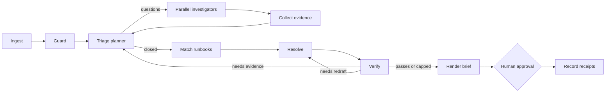

# Incident Response Agent

**Investigate production incidents with a multi-agent LangGraph workflow: parallel investigators, evidence-cited conclusions, prompt-injection quarantine, and a human approval gate before anything is final.**

[](https://github.com/Jenish-Shobhit/incident-response-agent/actions/workflows/ci.yml)
[](https://www.python.org/)
[](LICENSE)

**[Live demo →](https://dpdduyx82d5bu.cloudfront.net)** Press **Investigate**, then approve or reject the plan. A recorded run replayed in the real console, served as static files from a private S3 bucket through CloudFront -- no model or key is exposed.


## Quick start

```bash
git clone https://github.com/Jenish-Shobhit/incident-response-agent.git
cd incident-response-agent
make setup     # .venv, dependencies, and a .env copied from .env.example
make run       # http://127.0.0.1:8000
```

That runs in **mock mode**: recorded model replies, deterministic, free, no keys. To run it against a real model, open `.env`, set `MOCK=0`, and paste your key:

```bash
MOCK=0
LLM_PROVIDER=anthropic
ANTHROPIC_API_KEY=sk-ant-...
```

Restart `make run`, or watch a whole investigation in the terminal with `make live`. Amazon Bedrock works the same way with `LLM_PROVIDER=bedrock`; every option is in [configuration](docs/configuration.md).

## What happens in a run



1. **Guard** scans every log line for the *form* of an instruction and redacts it from everything a model will see, while keeping it visible to the operator.
2. **The planner** has no tools. It reads a summary and sends bounded questions to a **log** and a **metric** investigator, which run in parallel, then decides again with what came back.
3. **Collect** drops any claim whose citations do not resolve to a real evidence record.
4. **The resolver** reads the shortlisted runbooks and proposes only actions that appear in them, each rated read-only, reversible, confirm, or human.
5. **The verifier** can read cited evidence but cannot search, so it checks the brief instead of arguing for it. A failure sends the run back for more evidence or a redraft.
6. **The run stops** at a LangGraph interrupt. Destructive steps need their runbook id typed. Approval resumes the run and records receipts -- no command is ever executed.

## The bundled incident

`INC-3172`, P1 on `inventory-service`: write latency p99 at 12.4s and a 27% 5xx rate, minutes after a deploy. The deploy's schema migration is building an index on `stock_levels` without `CONCURRENTLY`, and its lock queues every write.

The evidence is built to make shortcuts fail:

- **A tempting wrong fix.** A deploy just happened, so rolling it back looks obvious, but rolling back application code does not release a running migration's lock.
- **A metric that rules things out.** Database CPU is *below* baseline, so adding compute or replicas cannot help.
- **Units that invert naive arithmetic.** `12.4s` against `85ms` is 146x worse; parsing the numbers without units reports an improvement.
- **A planted prompt injection.** One log line claims to be from the on-call lead and asks the system to mark the incident resolved and drop the index in production.

The correct outcome is to **escalate**: mitigation steps exist, but the runbook says rebuilding the index is a human decision. The incident is synthetic and written for this project. To run your own, add a folder under [`scenarios/`](scenarios/) ([how](docs/architecture.md#adding-a-scenario)) or upload an incident file in the console.

## Design choices

- **Least privilege by construction.** Five read-only tools exist and nothing else; each agent is sent only the tools it is granted, so an injected "run this" has no verb to reach.
- **Two views of evidence.** Tools are handed the redacted view, so quarantined text is unreachable from any model path rather than merely discouraged.
- **Evidence discipline.** Every claim carries citation keys; ungrounded claims are dropped before the resolver sees them.
- **Units before arithmetic.** Metrics are compared in base units, and pairs, bounds and mismatched families are refused instead of guessed.
- **One model interface.** Mock fixtures, the Claude API and Bedrock Converse sit behind one `converse()` shape, so the tool loop is provider-independent and fully testable offline.

Details are in [architecture](docs/architecture.md).

## Project layout

```text
src/incident_agent/
  api.py              HTTP: serve the console, stream a run, take an approval
  config.py           every setting, read from .env and the environment
  graph/              LangGraph state, the eleven nodes, and the wiring
  agents/             the tool loop and the five system prompts
  llm/                one converse() over mock, Claude API, and Bedrock
  evidence/           normalise an incident, quarantine injections, compare metrics
  tools/              five read-only tools and per-agent grants
scenarios/            one folder per incident: data, runbook overlay, mock replies
web/                  the operator console and the recorded demo it can replay
scripts/              record the demo; run an incident in the terminal
tests/                behaviour tests, all offline
deploy/aws/           CloudFormation for the GitHub OIDC deploy role
docs/                 architecture, configuration, deployment
```

## Development

```bash
make help      # every command
make check     # lint + tests, exactly what CI runs
make demo      # re-record web/demo/frames.json after changing the scenario or graph
```

Tests defend behaviour rather than implementation: injection quarantine and rewordings, unit conversion, tool grants, evidence preservation, graph routing and loops, the approval gate, thinking-block replay for the Claude API, and the HTTP contract. They always run in mock mode.

## Deployment

- **Public demo:** static replay on S3 + CloudFront, deployed by CI through GitHub OIDC -- no stored AWS keys. The role is [defined as code](deploy/aws/github-deploy-role.yaml) and can only write one bucket and refresh one distribution.
- **Full app:** the non-root [`Dockerfile`](Dockerfile) (health-checked, smoke-tested in CI) or the [Render Blueprint](render.yaml) in mock mode.

Setup, verification, teardown and the live-model path are in [deployment](docs/deployment.md).

## Limitations

- Approval checkpoints use an in-memory saver. Run one process; a restart drops pending approvals.
- Live mode has no authentication or rate limiting. It is for local use until those exist.
- Plans end in receipts. The system deliberately has no tool that changes infrastructure.
- The bundled incident is synthetic and says nothing about performance on arbitrary production telemetry.

The staged path past these is in [deployment](docs/deployment.md#production-hardening-path).

## License

[MIT](LICENSE) © 2026 Jenish Shobhit
